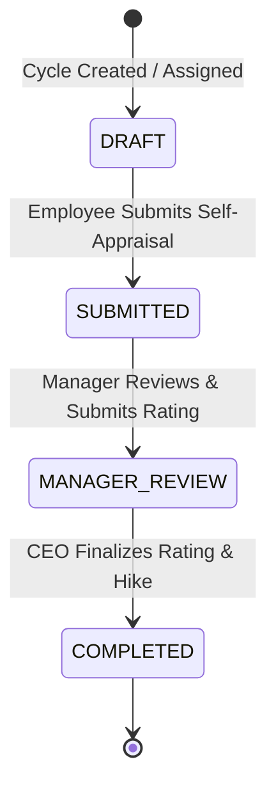

# Product Requirement Document (PRD)
## Project: Appraisal Automation System (Laravel & Gemini AI)

---

## 1. Document Control
* **Document Version**: 1.0.0
* **Date**: August 24, 2026
* **Target Environment**: Vercel Serverless (PHP 8.5) + Supabase (PostgreSQL)

---

## 2. Product Overview
The **Appraisal Automation System** is an employee performance appraisal and calibration platform. It structures a collaborative three-stage review workflow while leveraging **Gemini AI** to produce unbiased, objective performance summaries, sentiment scores, and risk indicators.

### System Vision
* **Transparency**: Clear visibility into appraisal cycles, deadlines, and ownership.
* **Objective Calibration**: Aligning textual narratives (employee self-evaluations, manager reviews) with numerical ratings and compensation decisions.
* **AI-Assisted Insights**: Leveraging LLMs to generate objective performance feedback and identify burnout or flight risk signals.

---

## 3. User Roles & Permissions

The system operates with distinct roles, dashboards, and capabilities:

| Role | Default Dashboard View | Core Capabilities |
| :--- | :--- | :--- |
| **Employee** | `my-appraisal` | Draft and submit self-appraisals (answers to questions, self-rate skills, enter KRAs). View historical completed appraisals. |
| **Manager** | `team-reviews` | Review direct reports' drafts, evaluate KRAs, rate core skills, write manager summaries, and submit to the CEO. |
| **CEO** | `ceo-panel` | Review manager-evaluated appraisals, set final performance ratings, allocate salary hike percentages, and finalize decisions. |
| **HR** | `hr-panel` | Manage appraisal cycles, adjust global deadlines, enroll employees, and analyze enterprise-wide budget impact and performance metrics. |

---

## 4. Appraisal Lifecycle & Stages

Each appraisal cycle transitions through four database-enforced states:

### Stage 1: Draft (`DRAFT`)
* **Owner**: Employee.
* **Requirements**:
  * Complete 7 qualitative narrative questions (Section One).
  * Declare Key Result Areas (KRAs) with weightage and self-ratings.
  * Evaluate self-ratings on 5 default skills (Technical Knowledge, Communication, Problem Solving, Ownership, Stakeholder Management).
* **Action**: Submit to Manager (locks the self-appraisal fields).

### Stage 2: Submitted (`SUBMITTED`)
* **Owner**: Manager.
* **Requirements**:
  * Review employee's answers, KRAs, and skill self-ratings.
  * Input manager ratings and comments on each KRA.
  * Input manager ratings on default skills.
  * Provide overall qualitative comments and an Overall Manager Rating (scale: 0–10).
* **Action**: Submit to CEO (locks the manager review fields).

### Stage 3: Manager Review (`MANAGER_REVIEW`)
* **Owner**: CEO.
* **Requirements**:
  * Review the compiled self-appraisal and manager evaluations.
  * Input final qualitative comments.
  * Set a Final Performance Rating (scale: 0–10).
  * Determine the Salary Hike Percentage (scale: 0–100%).
* **Action**: Finalize Appraisal (locks the entire appraisal, making it read-only).

### Stage 4: Completed (`COMPLETED`)
* **Status**: Read-only archive.
* **Visibility**: Viewable by Employee, Manager, CEO, and HR.

---

## 5. Key Modules & Functional Features

### 5.1 Self-Appraisal Form (Employee)
* **Qualitative Questionnaire (Section One)**:
  1. Has the past year been good/bad/satisfactory or otherwise for you, and why?
  2. What do you consider to be your most important achievements of the past year?
  3. What elements of your job do you find most difficult?
  4. What elements of your job interest you the most, and least?
  5. What action could be taken to improve your performance in your current position by you, and your boss?
  6. What sort of training/experiences would benefit you in the next year? (including natural strengths and personal passions).
  7. Mention if you have any grievances/problems/areas of dissatisfaction affecting your performance.
* **KRA Evaluation**: Flexible table allowing employees to list multiple targets, assign weightage (adding up to 100%), self-rate, and add commentary.
* **Core Skills Slider**: Scale of 1–5 for default skills. Custom skills can be added dynamically.

### 5.2 Manager Review Console
* Read-only view of employee self-ratings.
* Parallel input fields for manager score on each KRA target.
* Parallel skill score sliders.
* Overall manager rating (0.0 to 10.0 scale, rounded to 2 decimal places).

### 5.3 CEO Finalization Console
* Direct access to all reviews awaiting final decision.
* Executive action inputs: Final Rating and Hike Percentage.
* Real-time calculation of overall performance distributions.

### 5.4 HR Admin Panel
* **Cycle Management**: Create `WORK` or `SALARY` cycles. Configure period labels (e.g. "Q3 2026"), and active dates.
* **Employee Enrollment**: Batch enroll all staff members or assign individuals to active cycles.
* **Metrics Dashboard**: 
  * Aggregated status counts (Total, Draft, Pending, Completed).
  * Team summaries showing appraisal completions and average ratings.
  * Budget impact metrics compiling cumulative hike percentages and average hikes (CEO/HR only).

---

## 6. Gemini AI Performance Coprocessor

When an appraisal is submitted by the Manager or CEO, the system triggers an appraisal analysis using **Gemini AI (`gemini-2.0-flash`)**.

### 6.1 Calibration Rubric
To prevent bias (e.g., gender, ethnicity, tenure, or formatting discrepancies), the model is instructed to:
1. Focus strictly on narrative evidence provided in the text.
2. Disregard unrelated personal metadata.
3. Compare qualitative adjectives (e.g., "consistent", "high-impact") against documented outcomes.
4. Calibrate the Manager/CEO's numerical scores against the narrative text, highlighting gaps.

### 6.2 Output Format & Sentiment Mapping
Gemini outputs a strict JSON schema containing:
* `performanceSummary`: Executive brief of performance.
* `sentimentLabel`: Calculated from a sentiment score:
  * **0.00 – 0.35**: `CONCERNING` (Major performance gaps)
  * **0.36 – 0.57**: `MIXED` (Some targets met, significant blockers)
  * **0.58 – 0.77**: `NEUTRAL` (Met standard expectations, reliable delivery)
  * **0.78 – 0.89**: `POSITIVE` (Exceeded expectations in scope or impact)
  * **0.90 – 1.00**: `EXCEPTIONAL` (Consistently outperformed, drove cross-team value)
* `sentimentScore`: Double (0.0 to 1.0).
* `strengths`: String array (Max 4).
* `weaknesses`: String array (Max 4).
* `riskSignals`: String array identifying bandwidth/burnout/dependency indicators.

### 6.3 Deterministic Rule-Based Fallback
If the API key is not configured, or if the model call fails, the system executes a fallback analyzer:
* Calculates a baseline sentiment score using KRA ratings.
* Uses regex patterns (e.g. checking for keywords like "burnout", "led", "support", "outstanding") to extract strengths, weaknesses, and risk signals.

---

## 7. Database Entity Relationship (ER) Summary

The relational model utilizes string-based UUID primaries:

* **Teams**: Defines organizational units led by a Manager (`managerId`).
* **Employees**: User profiles containing code, DOJ, department, designation, salary, and relationship structure (direct reports mapping to manager).
* **Users**: Authentication layer linking to an `employeeId` with distinct roles (`EMPLOYEE`, `MANAGER`, `CEO`, `HR`).
* **Appraisal Cycles**: Tracks timeframes and types (`WORK`, `SALARY`) of active appraisal batches.
* **Appraisals**: Core record tracking stages, ratings, narrative texts (encoded JSON), and Gemini analysis outputs.
* **KRAs**: Individual targets associated with an appraisal.
* **Skill Ratings**: Double ratings (employee self-rating vs. manager rating) mapped to specific competencies.
* **System Settings**: Houses global start/end deadlines.

---

## 8. Deployment & Hosting Architecture (Vercel Serverless)

To deploy this Laravel application successfully onto Vercel, the architecture incorporates:

### 8.1 Serverless Runtime
* **Runtime**: PHP 8.5 via the `vercel-php@0.9.0` community builder.
* **Stateless Operations**: Since serverless lambdas run on a read-only filesystem, Laravel's storage directories (sessions, views compile, cache) are dynamically bound to `/tmp` on runtime boot inside `bootstrap/app.php`.

### 8.2 Asset Compilation (Vite + Fontaine)
* **Vite**: Bundles and compiles assets into the `public/build` directory.
* **Fontaine**: Used as a build dependency to optimize font loading metrics (Instrument Sans) to eliminate layout shifts (CLS).
* **Asset Routing**: `vercel.json` maps incoming requests for `/build/(.*)` directly to `/public/build/$1` to ensure direct static serving.

### 8.3 State and Database persistence
* **Database**: Direct connection to an external database (e.g., Supabase PostgreSQL) via SSL (`DB_SSLMODE=require`).
* **Connection Pooling**: Uses pgpool/Supabase Pooler (Port `6543`) to prevent serverless execution concurrency from exhausting database connection limits.
* **Session Storage**: Handled via external tables to persist user sessions across stateless invocations.
